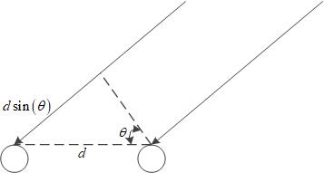

# CDR去混响

CDR/DDR定义:coherent-to-diffuse power ratio/direct-to-diffuse ratio
CDR可以等效认为是SNR(把混响和噪声一起考虑了)
参考文献：Coherent-to-Diffuse Power Ratio Estimation for Dereverberation

## 1.总结
### 1.1基本原理
本论文的基本原理是基于直达信号，和混响信号的空间相干系数不同来估计直达信号和混响信号的功率比。再根据这个功率比在频域上每个k计算一个系数。最后频域上的信号依次乘以这个系数得到了最终的去混响信号。

### 1.2步骤
* 估计信号+混响噪声总的空间相干系数（至少要2个麦克风才能获得空间相干系数）
* 估计TDOA（前置模块估计，根据不同算法可能也不需要）
* 根据麦克风距离，TDOA估计信号的空间相干系数，估计噪声的空间相干系数（根据选取的算法两个相干系数不一定都要估计，但至少要1个）
* 根据算法选取相干系数估计CDR
* 合并两个麦克风的信号（前处理）
* 根据CDR计算后置增益
* 前处理后的信号与后置增益相乘

### 1.3优缺点
* 至少要2个麦克风，才能获得空间的相干系数
* 超过2个麦克风怎么合并（前处理），也不清楚
* 计算简单，与FD-NDLP算法相比没有复杂的矩阵乘法和矩阵求逆
* 模型性能评估更加复杂，之前的FD-NDLP基于倒谱距离，这篇论文又比较了其他的，感觉去混响性能衡量标准不统一。本论文中比较了不同算法的识别概率、PESQ、fwSegSNR、ELR50ms、fwSegSNR50ms这些定义都来源于不同的文献，还没来得及研究。
* 加的混响需要满足各向同性的假设，否则不同算法的损失不一样
* 推荐用Proposed 2算法/Proposed 3算法，2性能最好，3更鲁棒。
* P2算法：在高CDR(SNR)下对TDOA的偏差（信号相干系数偏差）敏感，但高SNR时TDOA应该能估计较准；高CDR下对噪声相干系数偏差不敏感；低CDR下对信号相干系数偏差的敏感度仅次于P3算法；低CDR下对噪声相干系数偏差最不敏感（最好）
* P3算法：对信号相干系数偏差完全不敏感，不需要估计TDOA；唯一缺点是在低CDR下对噪声相干系数偏差比较敏感。
* 最后一步频域上的信号乘以1个增益系数可以去混响的原理没有太明白

## 2.信号模型

两个麦克风的信号时域模型如下：
$$x_{i}(t)=s_{i}(t)+n_{i}(t),i=1,2. $$
其中$n_{i}(t)$中包含混响
假设真帧号为$l$，频率为f。信号的自相关函数如下：
$$\Phi_{s1s1}(l,f)=\Phi_{s2s2}(l,f)=\Phi_s(l,f) $$
噪声自相关函数如下：
$$\Phi_{n1n1}(l,f)=\Phi_{n2n2}(l,f)=\Phi_n(l,f) $$
后面忽略帧号$l$，信噪比如下：
$$CDR(f)=SNR(f)=\frac{\Phi_{s}(f)}{\Phi_{n}(f)} $$
信号和噪声在空间上的相干系数分别如下：
$$\Gamma_{s}(f)=\frac{\Phi_{s1s2(f)}}{\Phi_{s}(f)},\Gamma_{n}(f)=\frac{\Phi_{n1n2}(f)}{\Phi_{n}(f)} $$
假设信号和噪声正交，所以有
$$\Phi_{x}(f)=\Phi_{s}(f)+\Phi_{n}(f) $$
信号和噪声在空间上总的相干系数如下：
$$\Gamma_{x}(f)=\frac{CDR(f)\Gamma_{s}(f)+\Gamma_{n}(f)}{CDR(f)+1} $$
上式可重写如下：
$$\Gamma_{x}(l,f)=\Gamma_{s}(f)+\frac{1}{CDR(l,f)+1}(\Gamma_{n}(f)-\Gamma_{s}(f)) $$
上式可以推出CDR公式如下：
$$CDR=\frac{\Gamma_{n}-\Gamma_{x}}{\Gamma_{x}-\Gamma_{s}} $$
上式中$\Gamma_{x}$可以通过实时统计得到，而$\Gamma_{s}$和$\Gamma_{n}$可以基于一些假设模型。

## 3.相干系数模型

* **直接信号**

$$\Gamma_{s}(f)=\frac{\Phi_{s1s2}(f)}{\Phi_{s}(f)}=e^{j2\pi \frac{d\sin(\theta)}{\lambda} }=e^{j2\pi f\Delta t} $$
其中$\Delta t=d\sin(\theta)/c$，波长$\lambda=c/f$，声速为$c$。这个相干系数的模值始终为1。另外$\Delta t$可以通过TDOA，$\theta$可以通过DOA估计得到。

* **混响（假设混响的$\theta$包含所有角度）**

假设噪声(混响)是球状的各向同性(自由空间)，噪声相干系数如下：
$$\Gamma_n(f)=\frac{\sin(2\pi fd/c)}{2\pi fd/c} $$
假设噪声(混响)是圆柱的各向同性(考虑地面和天花板)，噪声相干系数如下：
$$\Gamma_n(f)=J_{0}(2\pi fd/c) $$
**注意：两种假设下相干系数都是实数**

## 4.CDR估计

基于自相关和互相关函数估计，首先用$\alpha$滤波方式求相关函数：
$$\widehat{\Phi}_{xixj}(l,f)=\lambda \widehat{\Phi}_{xixj}(l-1,f)+(1-\lambda)X_{i}(l,f)X_{j}^{*}(l,f) $$
相干系数如下：
$$\widehat{\Gamma}_{x}(l,f)=\frac{\widehat{\Phi}_{x1x2}(l,f)}{\sqrt{\widehat{\Phi}_{x1x1}(l,f)\widehat{\Phi}_{x2x2}(l,f)}} $$
已知$CDR=\frac{\Gamma_{n}-\Gamma_{x}}{\Gamma_{x}-\Gamma_{s}}$和$\Gamma_{x}$，CDR是实数，但是直接用估计值代入这个等式计算出来的是复数，需要转为实数，算法如下表：
| 算法              | 公式    |  要求  |  是否无偏|
| --------          |-----   | ---- | ----------  |
| Jeub              | $\frac{\Gamma_{n}-\Re\{\Gamma_{s}^{*}\Gamma_{x}\}}{\Re\{\Gamma_{s}^{*}\Gamma_x\}-1} $               |$\Gamma_{n},\Gamma_s$ |no          |
| Thiergart 1       | $\Re\{\frac{\Gamma_{n}-\Gamma_{x}}{\Gamma_{x}-\Gamma_{s}}\} $      |$\Gamma_{n},\Gamma_{s} $ |   yes       |
| Proposed 1        | $\frac{\Re\{\Gamma_{s}^{*}(\Gamma_{n}-\Gamma_{x})\}}{\Re\{\Gamma_{s}^{*}\Gamma_x\}-1} $     | $\Gamma_{n},\Gamma_{s} $    | yes         |
| Proposed 2        | $\frac{1-\Gamma_{n}\cos(\arg(\Gamma_s))}{\|\Gamma_{n}-\Gamma_{s}\|}\|\frac{\Gamma_{s}^{*}(\Gamma_{n}-\Gamma_{x})}{\Re\{\Gamma_{s}^{*}\Gamma_{x}-1\}} \| $      |$\Gamma_{n},\Gamma_{s}$    |   yes       |
| Thiergart 2       | $\Re\{\frac{\Gamma_{n}-\Gamma_{x}}{\Gamma_{x}-e^{j\arg\Gamma_{x}}}\} $      |   $\Gamma_{n}$    |   no       |
| Proposed 3        |    $\frac{\Gamma_{n}\Re\{\Gamma_{x}\}-\|\Gamma_x\|^{2}-\sqrt{\Gamma_{n}^{2}\Re\{\Gamma_{x}\}^{2}-\Gamma_{n}^{2}\|\Gamma_{x}\|^{2}+\Gamma_{n}^{2}-2\Gamma_{n}\Re\{\Gamma_{x}\}+\|\Gamma_{x}\|^2}}{\|\Gamma_{x}^{2}\|-1} $      |   $\Gamma_n$    |     yes     |
| Proposed 4        |$ \begin{matrix}  \infty & if, \frac{\Im\{\Gamma_x\}}{\Im\{\Gamma_{s}\}}\geq1  \\   \frac{\Im\{\Gamma_{x}\}}{\Im\{\Gamma_{s}-\Gamma_x\}} & if, 0<\frac{\Im\{\Gamma_x\}}{\Im\{\Gamma_{s}\}}<1   \\  0 & if, \frac{\Im\{\Gamma_x\}}{\Im\{\Gamma_{s}\}}\leq0  \end{matrix} $     |   $\Gamma_s$    | yes  |

* **Jeub算法**
假设direct(直接)信号到达2个麦克风是时间对齐的，因此可以给$\Gamma_x$乘以$e^{-j2\pi f\widehat{\Delta t}}=\Gamma_{s}^*$。
缺点：只有$\Gamma_{s}=1\Leftrightarrow \widehat{\Delta t}=0$是无偏的。

* **Thiergart 1**
直接对公式$CDR=\frac{\Gamma_{n}-\Gamma_{x}}{\Gamma_{x}-\Gamma_{s}}$求实部虽然无偏，但是对$\Gamma_x$和$\Gamma_s$之间的相位偏差很敏感。

* **Proposed 1**
消除Jeub算法的偏差

* **Proposed 2**
首先基于Propose 1，将分子取实部变为取模，如下式：
$$CDR_{pro2}=|\frac{\Gamma_{s}^{*}(\Gamma_{n}-\Gamma_{x})}{\Re\{\Gamma_{s}^{*}\Gamma_{x}\}-1}| $$
这个式子在非0的TDOA时，会有很小的估计偏差，表格中的式子为修正偏差后的公式。这个偏差的修正对实际新能的影响可以忽略不记。

* **Thiergart 2**
前面的几种算法，需要知道DOA来获得$\Gamma_s$，我们又已知$\Gamma_s$的模值为1。
这种算法直接用互相关函数$\widehat{\Phi}_{x1x2}$的相位，代替直接信号的相位所以有：
$\Gamma_{s}=e^{j\arg\widehat{\Phi}_{x1x2}}=e^{j\arg\Gamma_{x}}$
当CDR很小时，$\Gamma_x$主要由混响的相干系数组成因此趋紧于实数，当$\theta\ne0^\circ $，而此时$\Gamma_{s}$被估计为1，所以这个算法是有偏的。

* **Proposed 3**
$\Gamma_s$是复平面上的一个圆。
$CDR=\frac{\Gamma_{n}-\Gamma_{x}}{\Gamma_{x}-\Gamma_{s}}\Rightarrow \Gamma_{s}=\Gamma_{x}-\frac{\Gamma_{n}-\Gamma_x}{CDR}$
又$\Gamma_s$是复平面上的一个圆，所以有$|\Gamma_{s}|=1\Rightarrow (|\Gamma_x|^{2}-1)CDR^{2}-2\Re\{\Gamma_{x}(\Gamma_{n}-\Gamma_{x})^{*}\}CDR+|\Gamma_{n}-\Gamma_{x}|^{2}=0 $
根据上式可以推的表中公式。

* **Proposed 4**
根据$\Im\{\Gamma_{n}\}=0$和$CDR=\frac{\Gamma_{n}-\Gamma_{x}}{\Gamma_{x}-\Gamma_{s}}\Rightarrow\Im\{\Gamma_{n}\}=\Im\{\Gamma_{x}+CDR(\Gamma_{x}-\Gamma_{s})\}=0$
所以有：$CDR=\frac{\Im\{\Gamma_{x}\}}{\Im\{\Gamma_{s}-\Gamma_x\}} $
这个算法有一个内在的约束，就是要求$\Gamma_s\ne0$，否则虚部就消失了。所以对TDOA/DOA很小的场景很敏感。

## 5.CDR用于语音增强

语音增强框图如下：

麦克风信号合并（前处理）如下：
$$Y(l,f)=\frac{1}{2}\sqrt{|X_{1}(l,f)|^{2}+|X_{2}(l,f)|^2}\cdot e^{j\arg X_{1}(l,f)} $$

后置增益如下：
$$G(l,f)=\max\{G_{\min},1-\sqrt{\frac{\mu}{\widehat{CDR}(l,f)+1}} \}$$
增强算法如下：
$$Z(l,f)=G(l,f)Y(l,f)$$
$\mu$为过减因子，$G_{\min}$为最小增益。